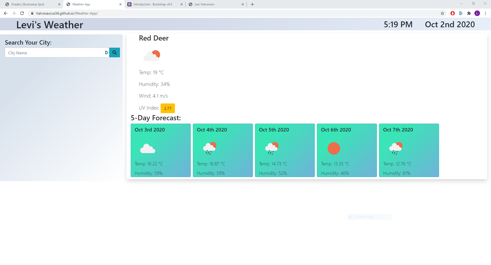

# Weather-App

# Description

We were asked to create a weather app that displayed the weather for the current day, as well as 5 days into the future. Including the city name, the date, an icon representation of weather conditions, the temperature, the humidity, the wind speed, and the UV index. A search bar with a history. When a city that is in the history is clicked, you are presented with that city's weather. When you re-open the dashboard, you are presented with the last searched city forecast.

## Issues

The main issues were learning and using the weather API. Trying to figure out what all the response data was.

## Collaborators

With instruction from Fil and Daniel.

---

[Filipe Laborde-Basto's](https://github.com/c0dehot) GitHub.

---

[Daniel Cabellos](https://github.com/shibeknight) GitHub.

---

## Links

---

[GitHub Repository](https://github.com/Halvosaurus34/Weather-App)

---

[Weather App](https://halvosaurus34.github.io/Weather-App/)

---

I used [Font Awesome](https://fontawesome.com/) for my Icons.

---

I also used [Bootstrap](https://getbootstrap.com/).

---

I used Moment.js for the time and date [Moment.js](https://momentjs.com/)
